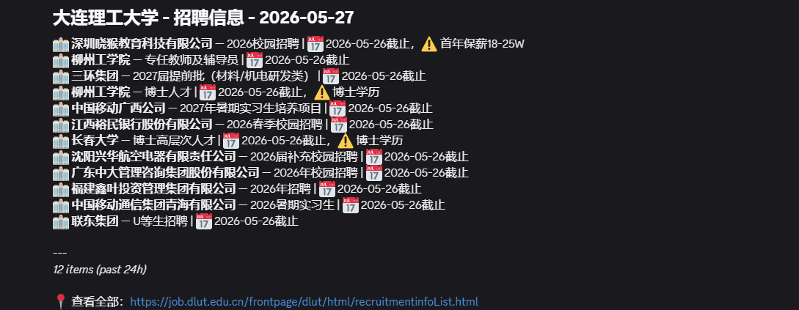
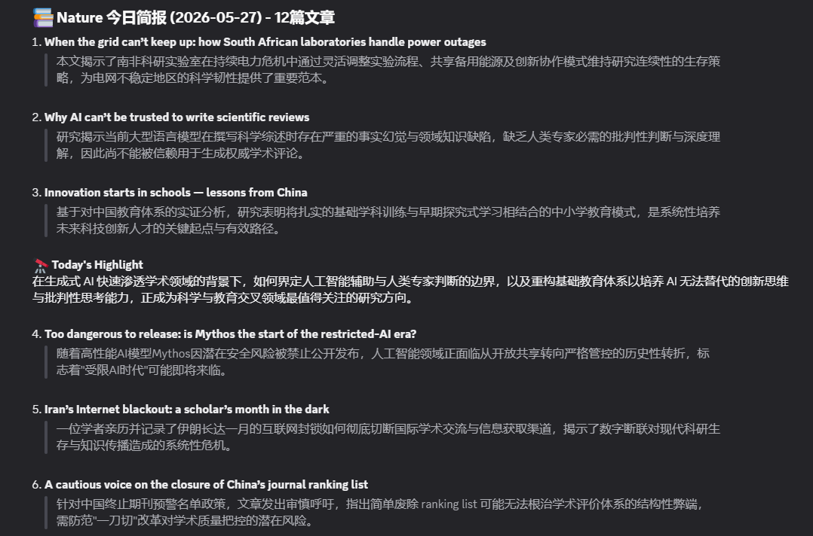
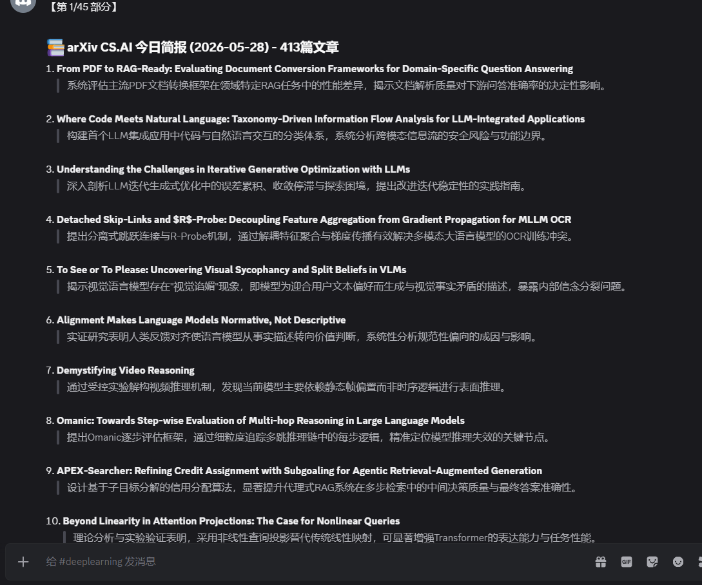
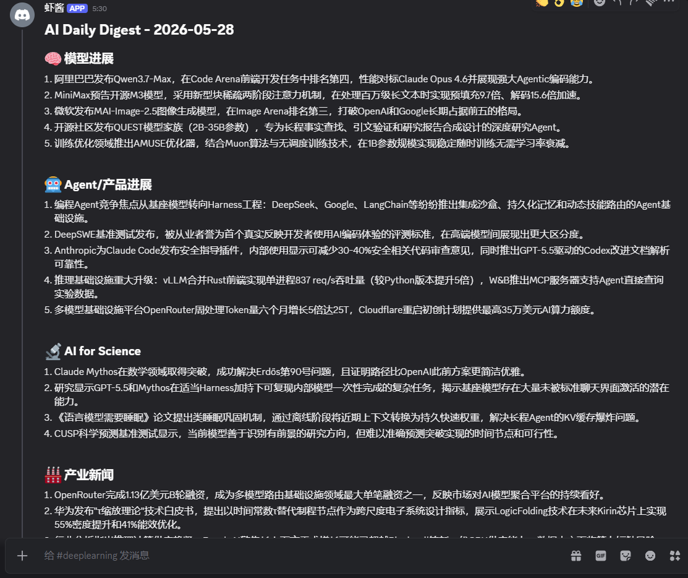
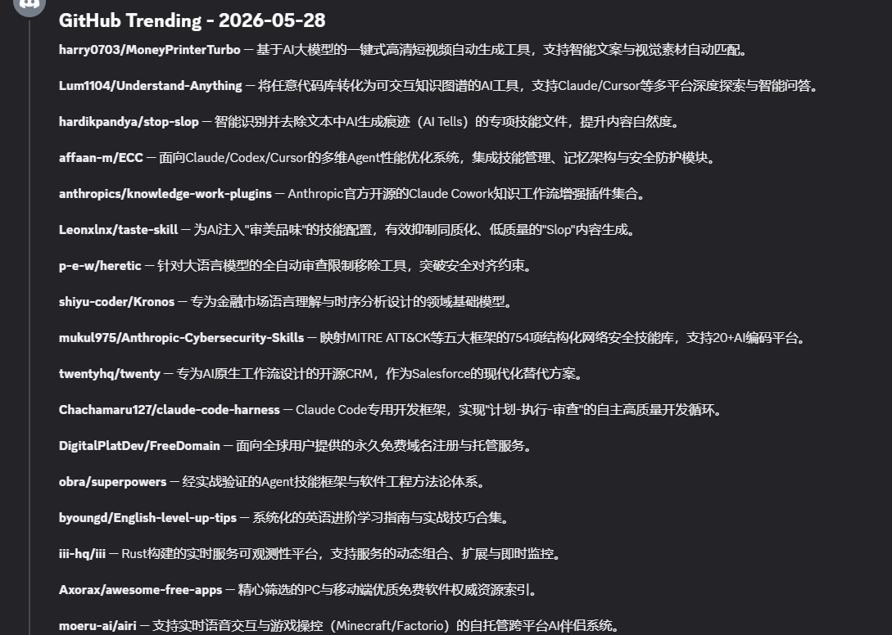
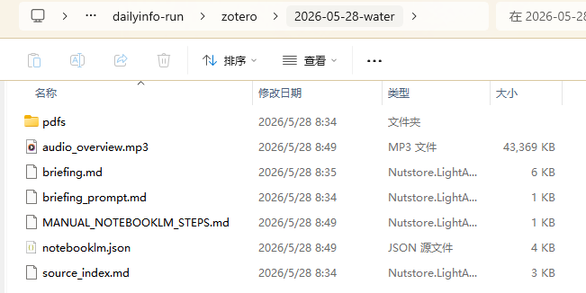

# DailyInfo

[中文](README.zh-CN.md) | English

DailyInfo is an automated research intelligence system for AI for Science researchers. It collects papers, AI news, code trends, and institutional updates, writes local Markdown briefings, pushes them to Discord, and now provides an agent-operated Zotero -> NotebookLM workflow for paper briefings and audio/video overviews.

## Overview

Core flow:

```text
FreshRSS / scrape / API sources
  -> dailyinfo run
  -> Markdown briefings
  -> dailyinfo push
  -> Discord channels + local archive
```

Agent-operated paper workflow:

```text
Zotero today's additions
  -> dailyinfo zotero-brief
  -> PDFs + source_index.md
  -> NotebookLM briefing
  -> Audio Overview / Video Overview
```

Design principles:

- Configuration-driven sources in `config/sources.json`.
- Idempotent CLI commands that can be safely rerun.
- External scheduling through cron, myopenclaw, openclaw, or other agent runtimes.
- Clear capability/operator split: DailyInfo provides stable commands; Claude Code, Codex, or openclaw operate the workflow.

## Screenshots

Put screenshots in `pictures/` with these names and they will render here.

### Discord Briefings

#### University Updates



#### Journal Papers



#### arXiv Papers



#### AI News



#### Code Trending



### NotebookLM Audio Overview



## Data Layout

Default data root: `~/.myagentdata/dailyinfo/`. Override it with `DAILYINFO_DATA_ROOT`.

```text
~/.myagentdata/dailyinfo/
├── freshrss/data/       # FreshRSS SQLite + config
├── briefings/           # Markdown files waiting to be pushed
│   ├── papers/
│   ├── ai_news/
│   ├── code/
│   └── resource/
├── pushed/              # Successfully pushed archive
│   ├── papers/
│   ├── ai_news/
│   ├── code/
│   └── resource/
└── zotero/              # Zotero -> NotebookLM run packages
    └── YYYY-MM-DD[-collection]/
        ├── source_index.md
        ├── briefing_prompt.md
        ├── pdfs/
        ├── briefing.md
        ├── notebooklm.json
        └── MANUAL_NOTEBOOKLM_STEPS.md
```

## Quick Start

```bash
git clone <repo-url>
cd dailyinfo

cp .env.example .env
# Fill OPENROUTER_API_KEY and DISCORD_BOT_TOKEN if you use the RSS/Discord pipeline.

uv sync --python python3
uv pip install -e .
dailyinfo install

# Optional: enable Zotero -> NotebookLM automation.
uv pip install -e ".[notebooklm]"

dailyinfo start
dailyinfo run
dailyinfo push
```

`dailyinfo install` validates `.env`, creates local data directories, and installs dependencies. It does not write crontab entries; scheduling belongs to your cron or agent runtime.

## Main Commands

| Command | Purpose |
|---------|---------|
| `dailyinfo install` | Validate environment and create data directories |
| `dailyinfo start` / `stop` / `restart` | Manage the FreshRSS container |
| `dailyinfo run` | Run all briefing pipelines |
| `dailyinfo run -p 1` | Pipeline 1: journal papers |
| `dailyinfo run -p 2` | Pipeline 2: AI news |
| `dailyinfo run -p 3` | Pipeline 3: arXiv CS.AI |
| `dailyinfo run -p 4` | Pipeline 4: code trending |
| `dailyinfo run -p 5` | Pipeline 5: university/resource |
| `dailyinfo run -f all` | Force regeneration for all sources |
| `dailyinfo push` | Push pending briefings to Discord and archive them |
| `dailyinfo push -d 2026-04-22` | Push briefings for a specific date |
| `dailyinfo status` | Show today's briefing/archive counts |
| `dailyinfo zotero-brief` | Prepare a Zotero -> NotebookLM paper briefing package |
| `dailyinfo zotero-brief --collection water --artifact audio` | Process the `water` collection and request Audio Overview |
| `dailyinfo zotero-brief --artifact video` | Request NotebookLM Video Overview |
| `dailyinfo zotero-brief --manual-only` | Prepare local materials without calling NotebookLM |

## Zotero -> NotebookLM Agent Workflow

`dailyinfo zotero-brief` is a capability command, not the preferred daily user interface. The recommended daily interface is a local agent:

- Claude Code slash command: `.claude/commands/zotero-notebooklm.md`
- Codex skill: `skills/zotero-notebooklm/SKILL.md`
- Future openclaw or other local runners can call the same CLI.

The workflow:

1. Reads Zotero papers by `dateAdded`.
2. Optionally restricts to a collection such as `water`.
3. Copies Zotero PDF attachments when available.
4. Opens Zotero attachment URIs to trigger cloud-drive hydration when PDFs are placeholders.
5. Uploads PDFs plus `source_index.md` to NotebookLM through `notebooklm-py`.
6. Asks NotebookLM to generate a Chinese paper briefing.
7. Optionally requests Audio Overview, Video Overview, or both.
8. Falls back to a local material package and manual steps if NotebookLM automation fails.

NotebookLM login is intentionally human-in-the-loop. The agent can open or prompt for the browser login, but the human completes Google authentication. The same `NOTEBOOKLM_HOME` must be used for login and later runs.

See:

- [Zotero NotebookLM Workflow](docs/zotero-notebooklm.md)
- [Zotero NotebookLM 工作流](docs/zotero-notebooklm.zh.md)
- [CLI Reference](docs/cli.md)

## Environment Variables

| Variable | Purpose |
|----------|---------|
| `DEEPSEEK_API_KEY` | DeepSeek API key (primary model for `dailyinfo run`) |
| `DISCORD_BOT_TOKEN` | Discord bot token for `dailyinfo push` |
| `DISCORD_CHANNEL_PAPERS` / `_AI_NEWS` / `_CODE` / `_RESOURCE` | Optional category channel IDs |
| `FRESHRSS_USER` | FreshRSS username |
| `FRESHRSS_PASSWORD` | FreshRSS initial password |
| `DAILYINFO_DATA_ROOT` | Override default data root |
| `OPENROUTER_API_KEY` | OpenRouter API key (optional, used for fallback model) |
| `DAILYINFO_ENV` | Environment: `prod` / `dev` / `staging` (default `prod`) |
| `DAILYINFO_FALLBACK_MODEL` | Fallback model when DeepSeek returns empty (default `moonshotai/kimi-k2.5`) |
| `ZOTERO_LOCAL_BASE_URL` | Zotero local API base URL, default `http://127.0.0.1:23119` |
| `NOTEBOOKLM_HOME` | NotebookLM profile/auth directory used by `notebooklm-py` |

## Scheduling and Agents

DailyInfo intentionally avoids owning the scheduler. Recommended ownership:

| Responsibility | Owner |
|----------------|-------|
| FreshRSS container and local data layout | DailyInfo |
| Markdown generation via `dailyinfo run` | DailyInfo |
| Discord push/archive via `dailyinfo push` | DailyInfo |
| Timed execution | cron, myopenclaw, openclaw, or agent runtime |
| Zotero/NotebookLM orchestration | Claude Code, Codex skill, or local agent |
| Browser login and sensitive prompts | Human |

## Documentation

- [Architecture](docs/architecture.md)
- [CLI Reference](docs/cli.md)
- [Agent Config](docs/agent-config.md)
- [Zotero NotebookLM Workflow](docs/zotero-notebooklm.md)
- [Zotero NotebookLM 工作流](docs/zotero-notebooklm.zh.md)
- [Information Sources](docs/sources.md)

## License

BSD 3-Clause License. See [LICENSE](LICENSE) for details.
