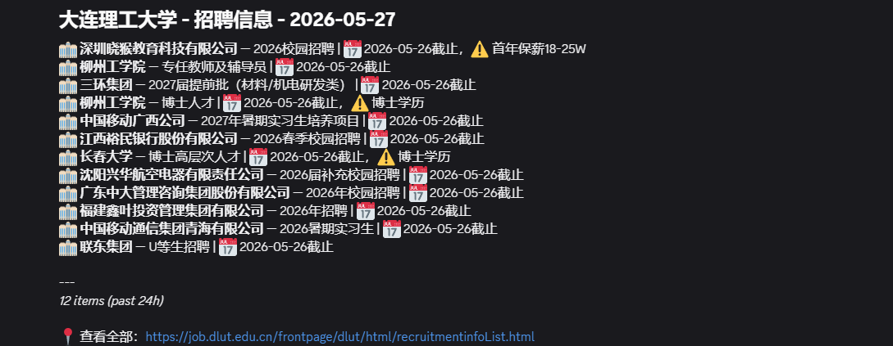
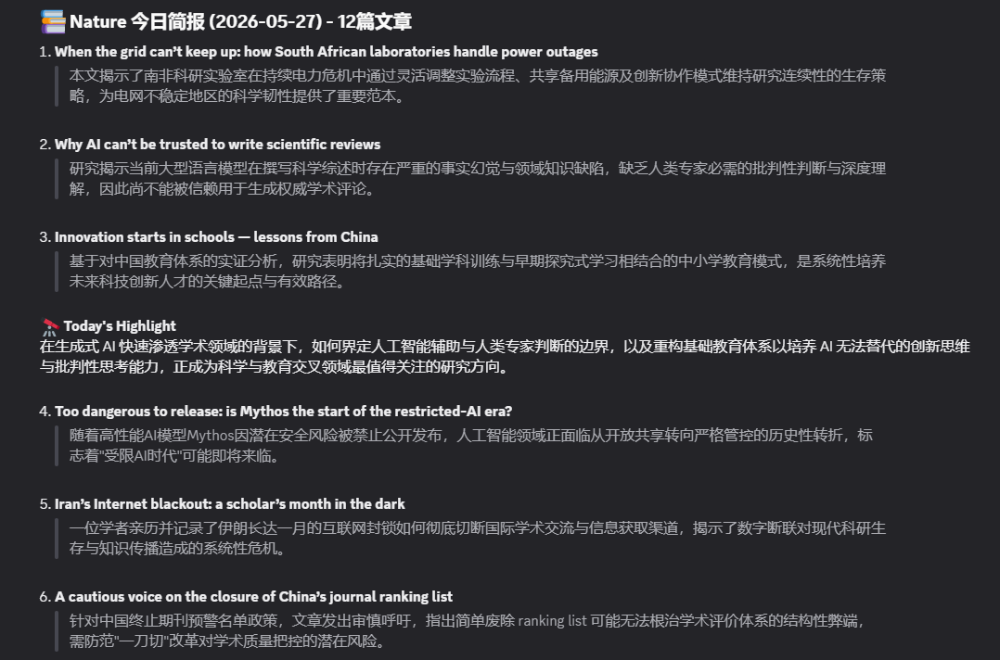
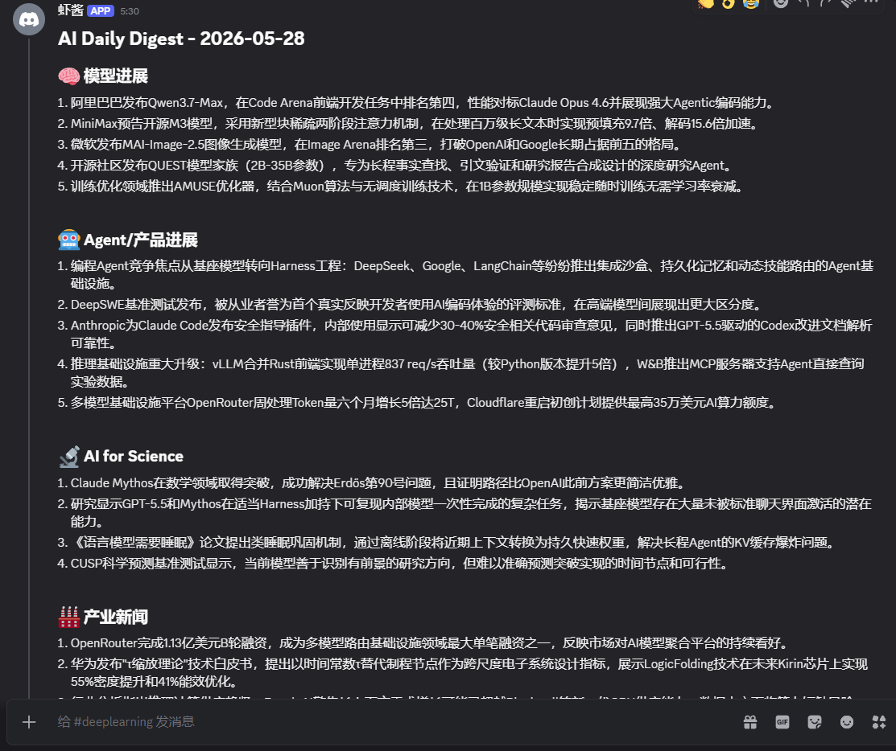
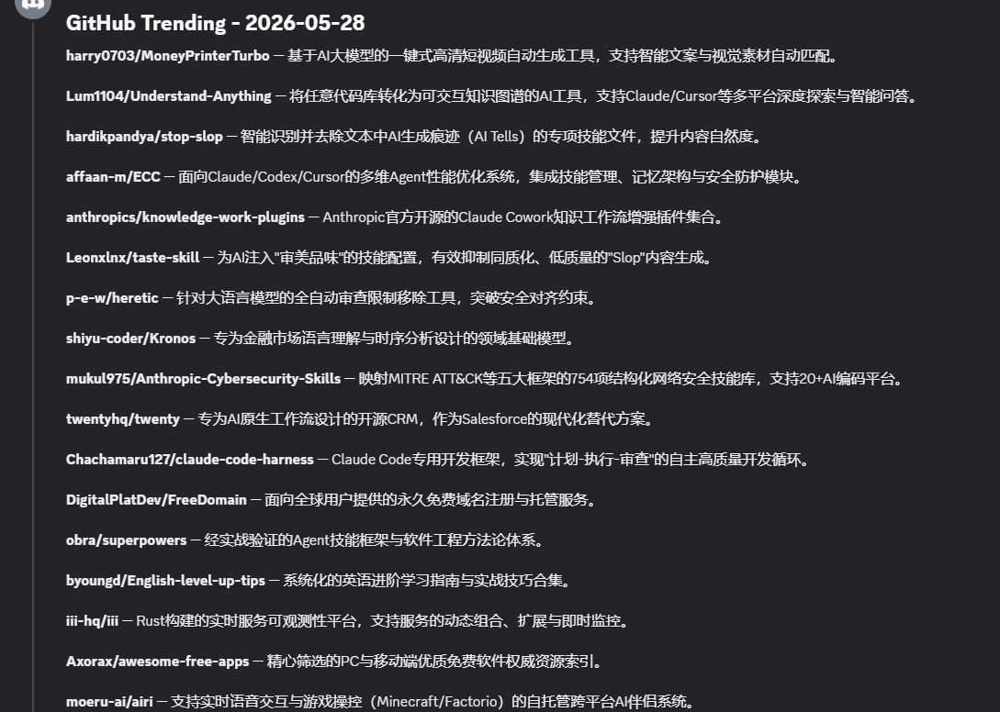

# DailyInfo

中文 | [English](README.md)

DailyInfo 是面向 AI for Science 研究者的自动化科研情报收集器。每天自动从 RSS 源、网页和 API 聚合期刊论文、AI 资讯、arXiv 预印本、代码趋势和院所动态,再用 DeepSeek 生成简洁的中文简报,直接推送到你的 Discord。

## 工作原理

一条流水线,六个相互独立的信息来源:

```text
FreshRSS / 网页抓取 / API 数据源
  -> dailyinfo run
  -> AI 生成的中文 Markdown 简报
  -> dailyinfo push
  -> Discord 频道 + 本地归档
```

1. **采集** — 六条独立流水线从 40+ 个 feed、页面和 API 拉取信息。一条流水线失败不影响其他。
2. **归纳** — DeepSeek 为每个数据源生成一份可读的中文简报,面向研究者优化:这些论文讲了什么、为什么重要、哪些值得细看。
3. **推送** — 简报进入你的 Discord 频道并本地归档。同一份内容永远不会重复发送。

每天醒来,你的领域内值得关注的一切已经整理成一份中文摘要等你查看——不用刷 feed 阅读器,没有邮件轰炸,没有噪音。

## 特性

| | |
|---|---|
| **六条流水线** | 期刊论文 · AI 资讯 · arXiv CS.AI · GitHub Trending + HuggingFace · 院所动态 · OpenReview 顶会论文与公开评审事件 |
| **中文优先简报** | AI 生成中文摘要;主模型 API 故障时自动降级到 OpenRouter 备用模型 |
| **配置驱动** | 在 `config/sources.json` 中添加 RSS、网页或 API 数据源,无需改代码 |
| **幂等,可安全重跑** | 已有今日简报的数据源自动跳过;已推送文件不会重复发送 |
| **高容错** | 指数退避重试、AI 响应不完整时自动拆分批次、数据源级隔离 |
| **调度无关** | 自带 cron、systemd timer 或 agent runtime——DailyInfo 负责流水线,不负责时钟 |

## 效果展示

把截图放到 `pictures/` 并使用下面的文件名后,会自动显示在这里。

### Discord 简报推送

#### 学校资讯



#### 期刊论文



#### arXiv 论文


#### AI 资讯



#### Code Trending



## 数据目录

默认数据根目录是 `~/.myagentdata/dailyinfo/`,可通过 `DAILYINFO_DATA_ROOT` 覆盖。

```text
~/.myagentdata/dailyinfo/
├── freshrss/data/       # FreshRSS SQLite + 配置
├── briefings/           # 待推送 Markdown
│   ├── papers/
│   ├── ai_news/
│   ├── arxiv/
│   ├── code/
│   ├── conference/
│   └── resource/
└── pushed/              # 已推送归档
    ├── papers/
    ├── ai_news/
    ├── arxiv/
    ├── code/
    ├── conference/
    └── resource/
```

## 快速开始

```bash
git clone <repo-url>
cd dailyinfo

cp .env.example .env
# 填写 DEEPSEEK_API_KEY 和 DISCORD_BOT_TOKEN。

uv sync --python python3
uv pip install -e .
dailyinfo install

dailyinfo start
dailyinfo run
dailyinfo push
```

`dailyinfo install` 会校验 `.env`、创建本地数据目录并安装依赖。它不会写入 crontab;定时调度由你的 cron 或 agent runtime 负责。

## 常用命令

| 命令 | 用途 |
|------|------|
| `dailyinfo install` | 校验环境并创建数据目录 |
| `dailyinfo start` / `stop` / `restart` | 管理 FreshRSS 容器 |
| `dailyinfo run` | 运行全部简报流水线 |
| `dailyinfo run -p 1` | 流水线 1：期刊论文 |
| `dailyinfo run -p 2` | 流水线 2：AI 资讯 |
| `dailyinfo run -p 3` | 流水线 3：arXiv CS.AI |
| `dailyinfo run -p 4` | 流水线 4：代码趋势 |
| `dailyinfo run -p 5` | 流水线 5：院所资讯 |
| `dailyinfo run -p 6` | 流水线 6：OpenReview 顶会论文 |
| `dailyinfo run -p 6 --source openreview_iclr_2026` | 只运行指定会议源 |
| `dailyinfo run -f all` | 强制重生全部数据源 |
| `dailyinfo push` | 推送待处理简报到 Discord 并归档 |
| `dailyinfo push -d 2026-04-22` | 推送指定日期简报 |
| `dailyinfo push -c weekly` | 只推送每周回顾 |
| `dailyinfo weekly` | 从近期简报生成每周 AI 资讯回顾 |
| `dailyinfo status` | 查看当天简报和归档数量 |
| `dailyinfo logs` | 查看执行日志 |
| `dailyinfo cache-clear` | 清除指定源的 FreshRSS 缓存(默认 `arxiv_cs_ai`) |
| `dailyinfo clean-cache` | 删除超过 N 小时的 FreshRSS 缓存文件(默认 24h) |

## 环境变量

| 变量 | 用途 |
|------|------|
| `DEEPSEEK_API_KEY` | `dailyinfo run` 使用的 DeepSeek API key(主模型) |
| `DISCORD_BOT_TOKEN` | `dailyinfo push` 使用的 Discord bot token |
| `DISCORD_CHANNEL_PAPERS` / `_AI_NEWS` / `_ARXIV` / `_CODE` / `_RESOURCE` / `_CONFERENCE` | 可选分类频道 ID |
| `OPENREVIEW_USERNAME` / `OPENREVIEW_PASSWORD` | OpenReview 认证（可选，必须同时设置；默认仍只推送公开内容） |
| `FRESHRSS_USER` | FreshRSS 用户名 |
| `FRESHRSS_PASSWORD` | FreshRSS 初始密码 |
| `DAILYINFO_DATA_ROOT` | 覆盖默认数据根目录 |
| `OPENROUTER_API_KEY` | OpenRouter API key(可选,用于备用模型) |
| `DAILYINFO_ENV` | 环境：`prod` / `dev` / `staging`(默认 `prod`) |
| `DAILYINFO_FALLBACK_MODEL` | 主模型空响应时的备用模型(默认 `moonshotai/kimi-k2.5`) |

## 调度和 Agent 分工

DailyInfo 不负责调度。推荐分工如下：

| 职责 | 归属 |
|------|------|
| FreshRSS 容器和本地数据目录 | DailyInfo |
| `dailyinfo run` 生成 Markdown | DailyInfo |
| `dailyinfo push` 推送和归档 | DailyInfo |
| 定时执行 | cron、myopenclaw、openclaw 或 agent runtime |

## 文档

- [系统架构](architecture.md)
- [CLI 参考](cli.md)
- [Agent 配置](agent-config.md)
- [数据源说明](sources.md)

## License

BSD 3-Clause License. See [LICENSE](LICENSE) for details.
