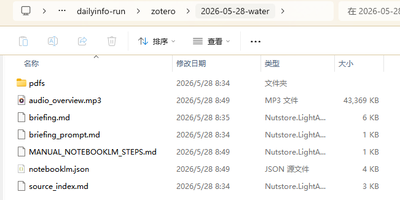

# DailyInfo

中文 | [English](README.md)

DailyInfo 是面向 AI for Science 研究者的自动化科研情报系统。它可以聚合论文、AI 新闻、代码趋势和院所资讯，生成本地 Markdown 简报，推送到 Discord，并提供一套由 agent 操作的 Zotero → NotebookLM 论文简报、音频概览和视频概览流程。

## 项目概览

核心流程：

```text
FreshRSS / 网页抓取 / API 数据源
  -> dailyinfo run
  -> Markdown 简报
  -> dailyinfo push
  -> Discord 频道 + 本地归档
```

Agent 操作的论文流程：

```text
Zotero 当天新增论文
  -> dailyinfo zotero-brief
  -> PDFs + source_index.md
  -> NotebookLM 简报
  -> Audio Overview / Video Overview
```

设计原则：

- 数据源配置化，集中在 `config/sources.json`。
- CLI 幂等，可以安全重跑。
- 调度交给 cron、myopenclaw、openclaw 或其他 agent runtime。
- 明确区分能力层和执行层：DailyInfo 提供稳定命令，Claude Code、Codex 或 openclaw 负责执行工作流。

## 效果展示

把截图放到 `pictures/` 并使用下面的文件名后，会自动显示在这里。

### Discord 简报推送

#### 学校资讯


#### 期刊论文


#### arXiv 论文


#### AI 资讯


#### Code Trending


### NotebookLM 音频概览



## 数据目录

默认数据根目录是 `~/.myagentdata/dailyinfo/`，可通过 `DAILYINFO_DATA_ROOT` 覆盖。

```text
~/.myagentdata/dailyinfo/
├── freshrss/data/       # FreshRSS SQLite + 配置
├── briefings/           # 待推送 Markdown
│   ├── papers/
│   ├── ai_news/
│   ├── code/
│   └── resource/
├── pushed/              # 已推送归档
│   ├── papers/
│   ├── ai_news/
│   ├── code/
│   └── resource/
└── zotero/              # Zotero -> NotebookLM 素材包和简报
    └── YYYY-MM-DD[-collection]/
        ├── source_index.md
        ├── briefing_prompt.md
        ├── pdfs/
        ├── briefing.md
        ├── notebooklm.json
        └── MANUAL_NOTEBOOKLM_STEPS.md
```

## 快速开始

```bash
git clone <repo-url>
cd dailyinfo

cp .env.example .env
# 如果使用 RSS/Discord 流程，填写 OPENROUTER_API_KEY 和 DISCORD_BOT_TOKEN。

uv sync --python python3
uv pip install -e .
dailyinfo install

# 可选：启用 Zotero -> NotebookLM 自动化。
uv pip install -e ".[notebooklm]"

dailyinfo start
dailyinfo run
dailyinfo push
```

`dailyinfo install` 会校验 `.env`、创建本地数据目录并安装依赖。它不会写入 crontab；定时调度由你的 cron 或 agent runtime 负责。

## 常用命令

| 命令 | 用途 |
|------|------|
| `dailyinfo install` | 校验环境并创建数据目录 |
| `dailyinfo start` / `stop` / `restart` | 管理 FreshRSS 容器 |
| `dailyinfo run` | 运行全部简报流水线 |
| `dailyinfo run -p 1` | 运行 RSS 论文/新闻流水线 |
| `dailyinfo run -p 2` | 运行代码趋势流水线 |
| `dailyinfo run -p 3` | 运行院所资讯流水线 |
| `dailyinfo run -f all` | 强制重生全部数据源 |
| `dailyinfo push` | 推送待处理简报到 Discord 并归档 |
| `dailyinfo push -d 2026-04-22` | 推送指定日期简报 |
| `dailyinfo status` | 查看当天简报和归档数量 |
| `dailyinfo zotero-brief` | 生成 Zotero -> NotebookLM 论文素材包 |
| `dailyinfo zotero-brief --collection water --artifact audio` | 处理 `water` collection 并请求音频概览 |
| `dailyinfo zotero-brief --artifact video` | 请求 NotebookLM 视频概览 |
| `dailyinfo zotero-brief --manual-only` | 只生成本地素材，不调用 NotebookLM |
| `dailyinfo download-pdf <doi>` | 打印下载指令（依赖 Claude Code 操作） |
| `uv run python scripts/zotero_sync.py <pdf> <doi>` | 将已下载 PDF 同步到 Zotero（linked_file，不占云配额） |

## 下载 PDF → Zotero 同步工作流

> **此工作流依赖 Claude Code。** 下载步骤使用 Claude Code 的 Playwright MCP 插件进行浏览器自动化——不能作为独立 CLI 命令运行。

### 它做什么

1. **下载** — Claude Code 在独立的 Chromium 中导航出版商网站，完成机构登录（大连理工大学 SSO），触发 PDF 下载。
2. **验证** — `scripts/download_pdf.py verify` 检查 PDF 文件头并提取元数据。
3. **同步** — `scripts/zotero_sync.py` 将 PDF 复制到 Google Drive 并创建 Zotero linked_file 条目（零云存储，由 ZotMoov 管理）。

### 每台机器一次性配置

```bash
# 1. 在 Claude Code 设置中启用 Playwright 插件
#    编辑 ~/.claude/settings.json → enabledPlugins → 添加：
#    "playwright@claude-plugins-official": true

# 2. 安装 Chromium（如果插件未自动下载）
npx playwright install chromium

# 3. 安装 Zotero 同步依赖
uv pip install pyzotero

# 4. 在 .env 中配置 Zotero API 访问
#    ZOTERO_API_KEY=<key>       # 从 https://www.zotero.org/settings/keys 创建
#    ZOTERO_LIBRARY_ID=<id>     # 数字型用户 ID
#    GDRIVE_PAPERS_PATH=<path>  # 本地 Google Drive 论文文件夹路径
```

### 如何使用

在 Claude Code 中打开本仓库，然后输入：

```
/download-pdf 10.1038/s41586-026-10704-3
```

Agent 会打开 Chromium 窗口，导航到论文页面，处理下载，并同步到 Zotero。
你只需要在以下情况操作：
- **Cloudflare 验证**出现时（Wiley/AGU）——在浏览器中点击人机验证复选框
- **需要机构登录**时——在浏览器窗口中完成大连理工大学统一认证

完整 agent 工作流和出版商特定模式见 [`skills/download-pdf/SKILL.md`](skills/download-pdf/SKILL.md)。

## Zotero -> NotebookLM Agent 工作流

`dailyinfo zotero-brief` 是能力命令，不是推荐的每日人工入口。推荐的日常入口是本地 agent：

- Claude Code slash command：`.claude/commands/zotero-notebooklm.md`
- Codex skill：`skills/zotero-notebooklm/SKILL.md`
- 未来 openclaw 或其他本地 runner 也可以调用同一套 CLI。

工作流会：

1. 按 Zotero `dateAdded` 读取论文。
2. 可限定 collection，例如 `water`。
3. 复制 Zotero PDF 附件。
4. PDF 是云盘占位文件时，打开 Zotero 附件 URI 触发 Google Drive 等同步客户端下载。
5. 通过 `notebooklm-py` 上传 PDF 和 `source_index.md` 到 NotebookLM。
6. 让 NotebookLM 生成中文论文简报。
7. 可选生成 Audio Overview、Video Overview 或两者。
8. NotebookLM 自动化失败时，保留本地素材包和手动兜底步骤。

NotebookLM 登录有意保留人工参与。Agent 可以打开浏览器或提示登录，但 Google 认证由人完成。登录和后续运行必须使用同一个 `NOTEBOOKLM_HOME`。

详见：

- [Zotero NotebookLM Workflow](docs/zotero-notebooklm.md)
- [Zotero NotebookLM 工作流](docs/zotero-notebooklm.zh.md)
- [CLI 参考](docs/cli.md)

## 环境变量

| 变量 | 用途 |
|------|------|
| `OPENROUTER_API_KEY` | `dailyinfo run` 使用的 OpenRouter API key |
| `DISCORD_BOT_TOKEN` | `dailyinfo push` 使用的 Discord bot token |
| `DISCORD_CHANNEL_PAPERS` / `_AI_NEWS` / `_CODE` / `_RESOURCE` | 可选分类频道 ID |
| `FRESHRSS_USER` | FreshRSS 用户名 |
| `FRESHRSS_PASSWORD` | FreshRSS 初始密码 |
| `DAILYINFO_DATA_ROOT` | 覆盖默认数据根目录 |
| `DAILYINFO_FALLBACK_MODEL` | 主模型空响应时的备用模型 |
| `ZOTERO_LOCAL_BASE_URL` | Zotero 本地 API 地址，默认 `http://127.0.0.1:23119` |
| `ZOTERO_API_KEY` | Zotero Web API 密钥（`zotero_sync.py` linked_file 同步用） |
| `ZOTERO_LIBRARY_ID` | 数字型 Zotero 用户库 ID（`zotero_sync.py` linked_file 同步用） |
| `GDRIVE_PAPERS_PATH` | Google Drive 论文文件夹本地路径（ZotMoov / 链接附件根目录） |
| `NOTEBOOKLM_HOME` | `notebooklm-py` 使用的 NotebookLM profile/auth 目录 |

## 调度和 Agent 分工

DailyInfo 不负责调度。推荐分工如下：

| 职责 | 归属 |
|------|------|
| FreshRSS 容器和本地数据目录 | DailyInfo |
| `dailyinfo run` 生成 Markdown | DailyInfo |
| `dailyinfo push` 推送和归档 | DailyInfo |
| 定时执行 | cron、myopenclaw、openclaw 或 agent runtime |
| Zotero/NotebookLM 编排 | Claude Code、Codex skill 或本地 agent |
| 浏览器登录和敏感提示 | 人 |

## 文档

- [系统架构](docs/architecture.md)
- [CLI 参考](docs/cli.md)
- [Agent 配置](docs/agent-config.md)
- [Zotero NotebookLM Workflow](docs/zotero-notebooklm.md)
- [Zotero NotebookLM 工作流](docs/zotero-notebooklm.zh.md)
- [数据源说明](docs/sources.md)

## License

BSD 3-Clause License. See [LICENSE](LICENSE) for details.
